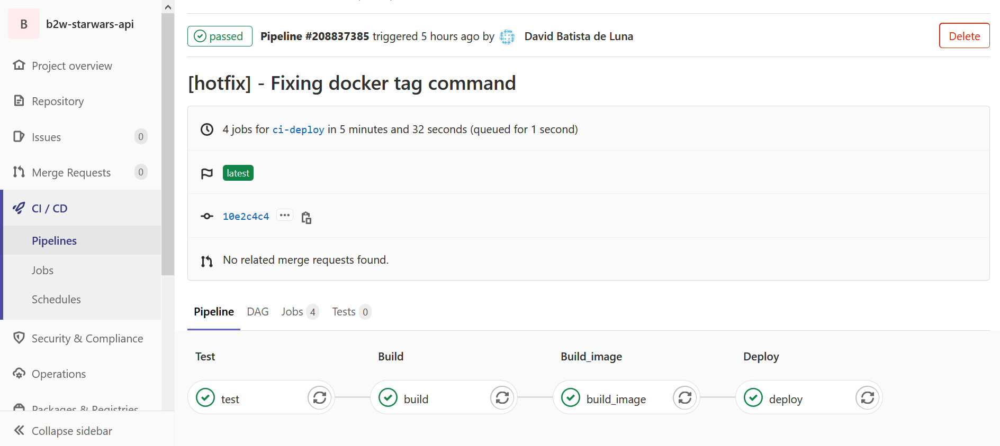

<h1 align="center">  B2W Star Wars Api </h1>

<p align="center">
  API desenvolvida devido ao desafio da B2W para cadastro de planetas da consagrada franquia Star Wars.
  <br/>
  Neste projeto também se faz uso da API externa https://swapi.dev/
</p>

## Tecnologias Utilizadas

 * Java 1.8
 * SpringBoot 2.3.4.RELEASE
 * MongoDb
 * Springfox Swagger 2.7.0

 Link para a documentação da API com swagger: http://3.138.34.18/swagger-ui.html
</br>

## Primeiros Passos

<p>
  Com o intuito de testar meus conhecimentos em integração e deploy continup eu usei a aplicação desenvolvida e coloquei nesta branch para criar um pipeline de teste, build e deploy no gitlab.</br>
  Esta aplicação está atualmente rodando (não sei por quanto tempo pois retirei meu cartão da AWS), basta acessar os endpoints na sessão como utilizar.
</p>
 
## Features
 - Inserir Planeta
 - Listar planetas
 - Buscar por nome
 - Buscar por id
 - Deletar planeta
 
 ## Como utilizar


### Cadastrando planeta na base mongo

**POST** `http://3.138.34.18/api/planets`

```json

// request
{
  "name": "Endor",
  "climate": "temperate",
  "terrain": "forests, mountains, lakes"
}
```
```json
// response
{
  "id": "5f9318141e13d7090b7454fd",
  "name": "Endor",
  "climate": "temperate",
  "terrain": "forests, mountains, lakes",
  "numberOfFilms": 1
}

```

### Listando planetas cadastrados na base mongo

**GET** `http://3.138.34.18/api/planets`

```json

// response
[
  {
    "id": "5f9311a21e13d7090b7454fc",
    "name": "Tatooine",
    "climate": "arid",
    "terrain": "desert",
    "numberOfFilms": 5
  },
  {
    "id": "5f9318141e13d7090b7454fd",
    "name": "Endor",
    "climate": "temperate",
    "terrain": "forests, mountains, lakes",
    "numberOfFilms": 1
  }
]
```
### Buscando planeta pelo nome na base mongo

**GET** `http://3.138.34.18/api/planets/?name=`**[name]** </br></br>
`http://3.138.34.18/api/planets/?name=Endor`
```json

// response 
{
  "id": "5f9318141e13d7090b7454fd",
  "name": "Endor",
  "climate": "temperate",
  "terrain": "forests, mountains, lakes",
  "numberOfFilms": 1
}
```

### Buscando planeta pelo Id na base Mongo

**GET** `http://3.138.34.18/api/planets`**[ID]** </br></br>
`http://3.138.34.18/api/planets/5f930e861e13d7090b7454fb`
```json

// response 
{
  "id": "5f9318141e13d7090b7454fd",
  "name": "Endor",
  "climate": "temperate",
  "terrain": "forests, mountains, lakes",
  "numberOfFilms": 1
}
```

### Deletando planeta da base mongo pelo Id

**DELETE** `http://3.138.34.18/api/planets`**[ID]** </br></br>
`http://3.138.34.18/api/planets/5f930e861e13d7090b7454fb`
```json

// response 
//204 No Content
//No body returned for response
```
## Pipeline do Gitlab

